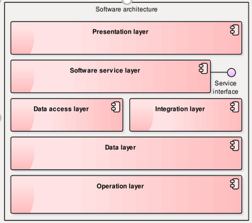
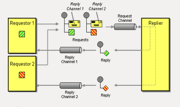
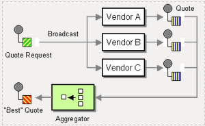
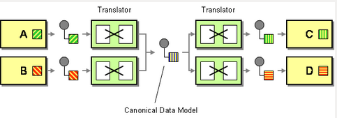
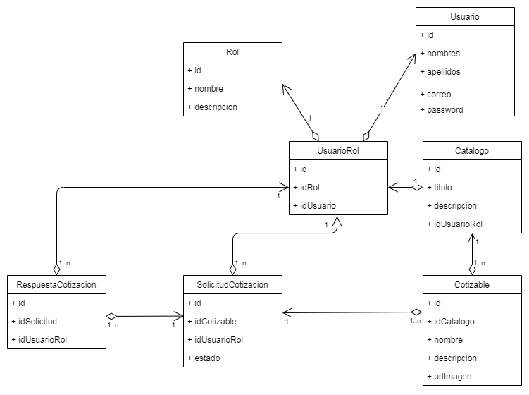
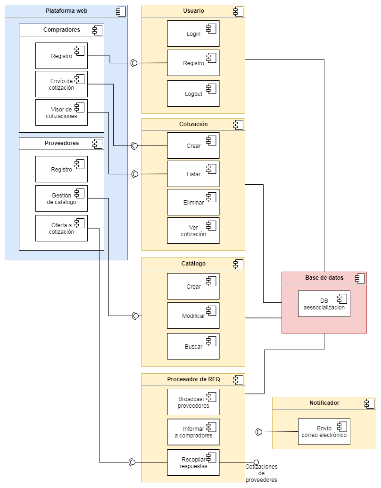
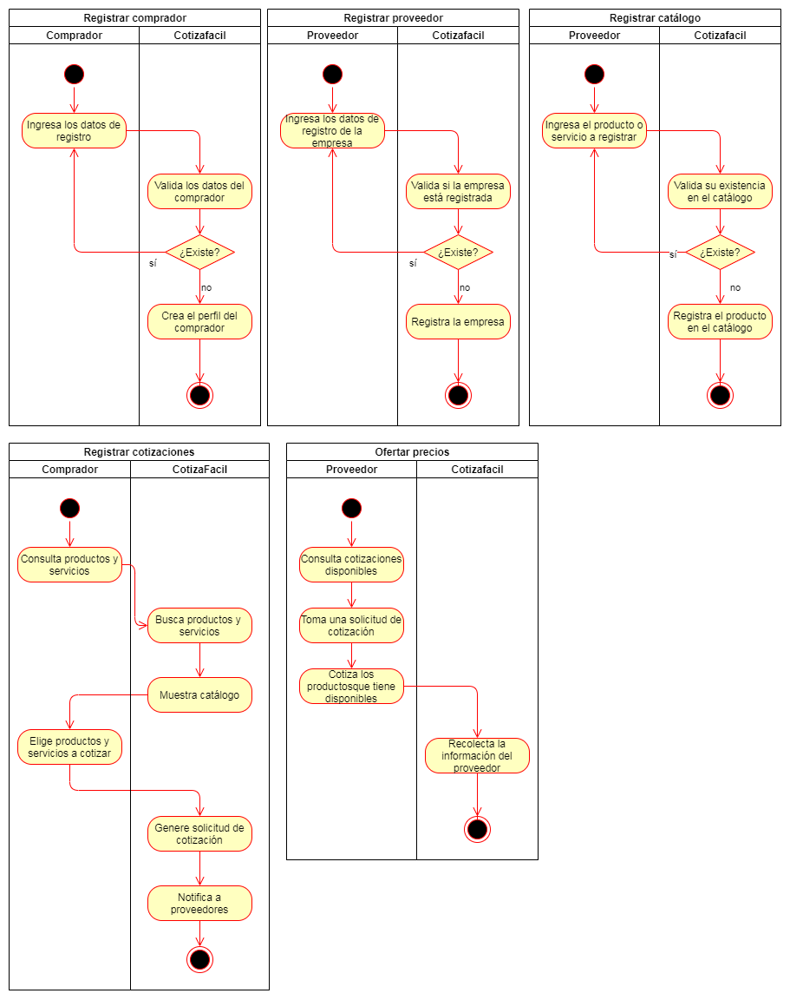
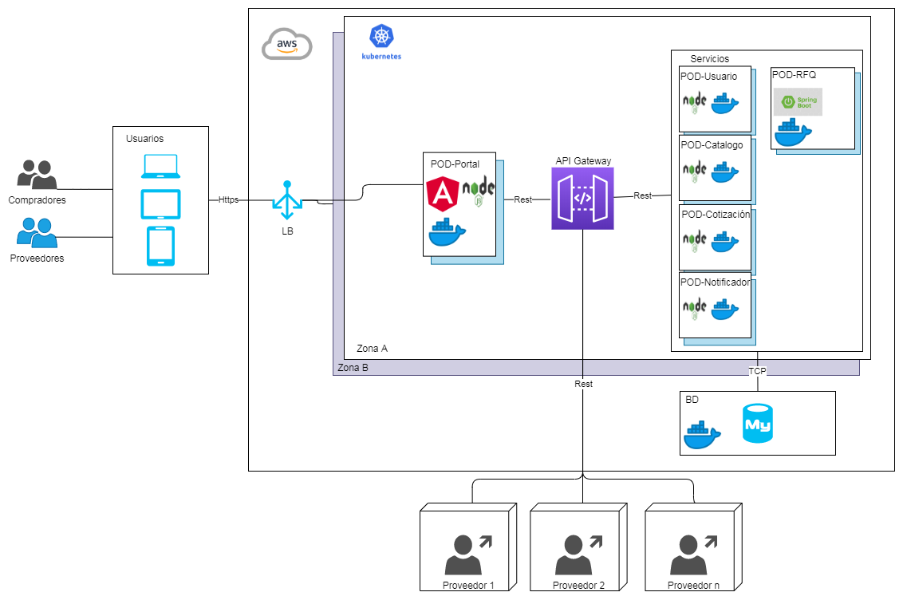
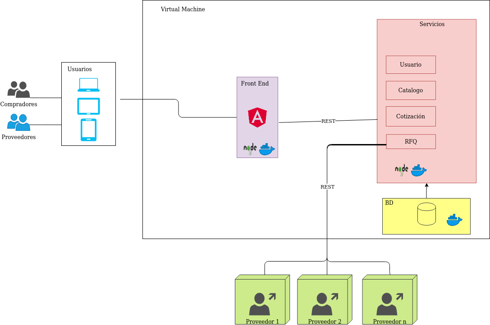

# Cotiza Fácil

La aplicación Cotiza Fácil fue desarrollada para ofrecer a compradores la oportunidad de cotizar productos con distintos proveedores y a su vez permitirles a los proveedores la integración a través de servicios o la gestión de su catálogo y respuesta a cotizaciones directamente desde la plataforma.

 Mas abajo se presentan la arquitectura seleccionada con un mayor nivel de detalle necesario para su implementación utilizando vistas 4+1.

## Requerimientos Funcionales Establecidos
|Código | Descripción |
| --- | --- |
|R00 |Inscripción e ingreso (login) de Clientes a través del portal |
|R01 |Inscripción e ingreso de proveedores |
|R02 | Registro de catálogos de bienes y servicios (Incluyendo precios) con el fin de ofrecer a esas empresas que no tiene un sistema de cotización una herramienta para controlar una parte de su operación (Venta).|
|R03 |Registro de cotizaciones por parte de los clientes autenticados, sobre los productos o servicios que busca.|
|R04 |Las cotizaciones deben ser constituidas por bienes y servicios (Limitado) de un catálogo el cual es importante para realizar posteriores ofertas por parte de los proveedores. El catálogo puede ser externo o interno.|
|R05 |Los sistemas de cotización de los proveedores deben integrarse con el sistema ofertas con cambios menores en sus arquitecturas |
|R06 | Se debe permitir que los proveedores oferten sus precios para una cotización registrada por un cliente, una vez se encuentre completa la oferta para la misma se debe notificar al cliente por medio de un Email y SMS |
|R07 |El cliente podrá ver una serie de estadísticas de manera gráfica acerca del estado de las aplicaciones hechas por todos los proveedores (Histórico de los proveedores y sus respectivas ofertas) |

### Restricciones a cumplir

|Código |Descripción |
| --- | --- |
|C01 | Los cambios que ocurran en las transacciones de negocio deberán reflejarse en tiempo real |
|C02 | Se requiere que el número de intercambios de información entre los participantes sea el menor posible. |
|C03 | Integración con plataformas de proveedores con reconfiguración flexible (Realizar cambios sin necesidad de reiniciar el sistema) |

## Atributos de Calidad de la solución
| Atributo | Descripcion |
| --- | --- |
|De alta disponibilidad |Que tenga una configuración de alta disponibilidad de más de 99%. Aunque no está explicito en la tabla de requerimientos inicial, se entiende que la disponibilidad es de suma importancia al ser un servicio de venta intermediario. Impacta a todos los requerimientos, en especial R03 y R06.| 
|Elástica|Maximizar uso de recursos y que pueda responder ágilmente a las condiciones del mercado. Aunque no está explicito en la tabla de requerimientos inicial, se espera tener un número creciente de usuarios y es importante soportar la demanda cuando crezca. Impacta a todos los requerimientos, en especial R03 y R06 |
|Mantenible|Que sea sencilla de actualizar y mejorar. Requerimiento R05 y restricción C03 |
|Interoperable|Que pueda funcionar con distintos proveedores. Basada en estándares abiertos. Altamente relacionado con el requerimiento R05, R06 y la restricción C03 |
|Usabilidad |Que tenga una experiencia de usuario sencilla y fácil de usar. Requerimiento R02, R03, R07 |
|Seguridad | Que no comprometa la información sensible de los usuarios en ninguno de los componentes de la solución. Requerimiento R00, R01 y restricción C02 |
|Auditable | El registro de las transacciones debe quedar registrado para auditorias externes y por el propio usuario. Requerimiento R07 |
|Rendimiento  | Que el uso de los recursos computacionales sea óptimo. Impacta la restricción C01, para el envío de respuestas en tiempo real. |

## Patrones de Diseño Implementados

### Patrón nuclear
  Publicador/Suscriptor
  
### Patrones complementarios
  *Capas:*
  
  
  
  
  *Cliente/Servidor*
  
  Patrones de Mensajería EAI 
  
   Return address 
   
   
    
   Scatter-Gather 
    
   
     	
   Canonical Data Model
    
   
    

### Tecnologias usadas
NodeJS
Angular
MongoDB
mbtest mountbank

## Vistas 4+1
### Vista Lógica

  

### Vista Desarrollo

  
 	
### Vista Procesos

  

### Vista 4+1

  
    
### Vista 4+1 Arquitectura alterna    

  

### Referencias

    - K. H. K. H. Frank Buschmann, «Publish and Subscribe,» de PATTERN-ORIENTED SOFTWARE ARCHITECTURE A Pattern Language for Distributed Computing, West Sussex, England, John Wiley & Sons Ltd, 2007, pp. 234-236.​
    - B. W. Gregor Hohpe, «Enterprise Integration Patterns,» [En línea]. Available: https://www.enterpriseintegrationpatterns.com/patterns/messaging/ReturnAddress.html. [Último acceso: 05 04 2020].​
    - B. W. Gregor Hohpe, «Enterprise Integration Patterns,» [En línea]. Available: https://www.enterpriseintegrationpatterns.com/patterns/messaging/BroadcastAggregate.html. [Último acceso: 05 04 2020].​
    - «Canonical Data Model,» Enterprise Integration Patterns, [En línea]. Available: https://www.enterpriseintegrationpatterns.com/patterns/messaging/CanonicalDataModel.html. [Último acceso: 17 04 2020].​
    - C. Richardson, «Scale Cube,» [En línea]. Available: https://microservices.io/articles/scalecube.html. [Último acceso: 17 04 2020].​
    - Google, «Set up High-Availability Kubernetes Masters,» Google, [En línea]. Available: https://kubernetes.io/docs/tasks/administer-cluster/highly-available-master/. [Último acceso: 17 04 2020].

